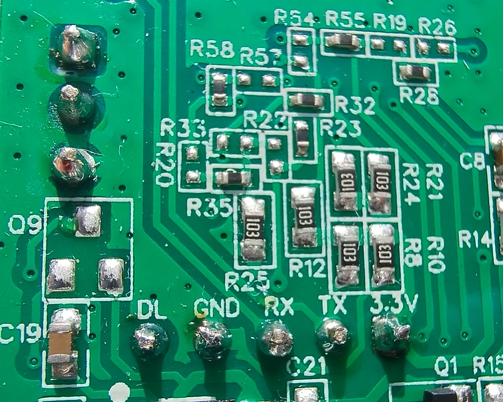
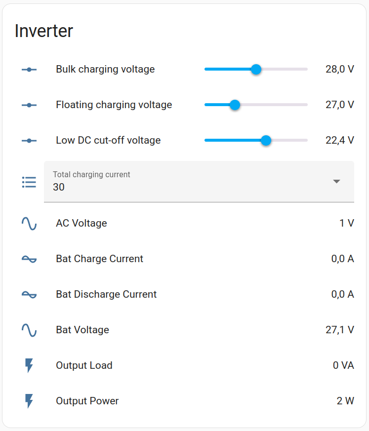

# PowMr inverter WiFi dongle

This firmware allows supervising PowMr invertors with the stock WiFi dongle.
The dongle EB-WF03-01 is powered with ESP8266 chip. It has two UART ports: one for
programming and interfacing with the invertor, the other one to read the logs.

This project isn't finished, I only develop it during power outages.
Motivation: [reserve power supply](https://sakhnik.com/2023/05/07/reserve-power.html).

## Running

Create the file `src/secrets.h` to satisfy the build:

```
pio -e esp12e run -t compiledb  # For LSP support
pio -e esp12e run
```

To put the MCU into the boot mode, ground the `DL` pin before powering the dongle.
Then connect a TTL-UART converter to `GND`, `RX`, `TX` and execute the command:

```
pio -e esp12e run -t upload
```

It is more convenient to update the firmware over the air once the initial version
has been flashed:

```
pio -e esp12e-ota run -t upload
```



## Configuring Home Assistant

When MQTT integration has been added to Home Assistant, the dongle will be automatically
discovered added to the system.



## Related projects

  - [odya/esphome-powmr-hybrid-inverter](https://github.com/odya/esphome-powmr-hybrid-inverter)
  - [mihaigsm2003/Deye2mqtt-Read-data-from-Deye-Sunsynk](https://github.com/mihaigsm2003/Deye2mqtt-Read-data-from-Deye-Sunsynk)
